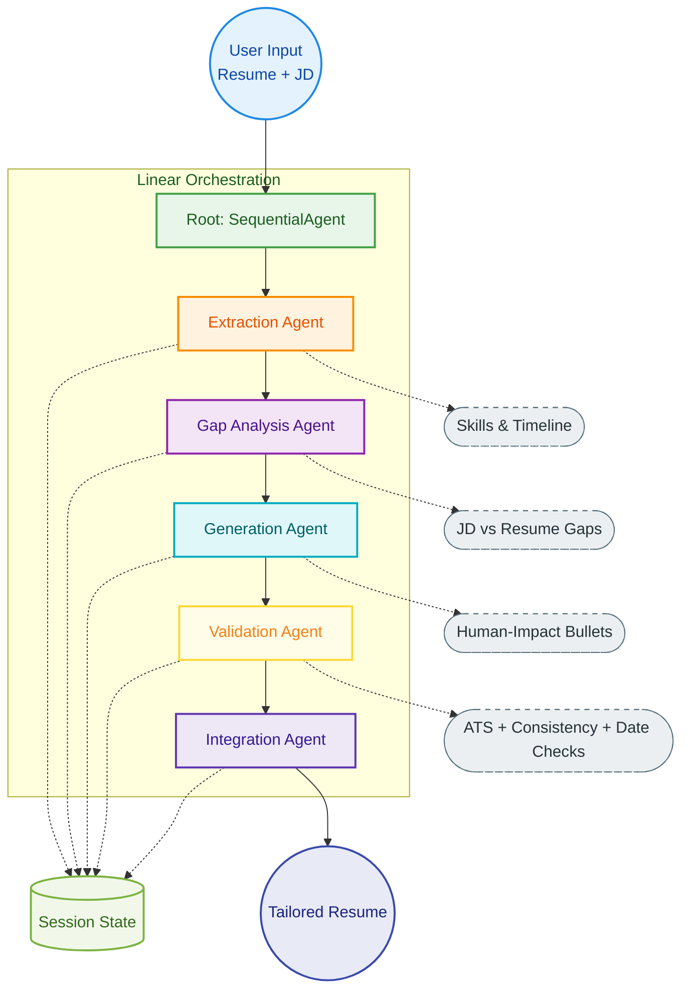

# Agentic Resume Analyzer — LLM-Powered JD Matching & Resume Tailoring

A **multi-agent AI pipeline** that ingests a job description and a resume, identifies skill gaps, generates ATS-optimized bullet points, validates consistency, and assembles a fully tailored resume — all orchestrated by a `SequentialAgent` with a Streamlit UI.

> **Skills demonstrated:** Agentic AI · Multi-agent orchestration · LLM pipelines · ATS optimization · State management · Streamlit · LangChain

---

## What It Does

Paste a job description + your resume. The system runs 5 specialized agents in sequence:

| Agent | What it does |
|-------|--------------|
| **Extraction Agent** | Parses skills, experience timelines, and requirements from both resume and JD |
| **Gap Analysis Agent** | Identifies mismatches between candidate background and job requirements |
| **Generation Agent** | Crafts impactful, human-readable bullet points targeting the JD |
| **Validation Agent** | Runs ATS checks, date consistency verification, and keyword coverage |
| **Integration Agent** | Assembles the final tailored resume document |

---

## Architecture



---

## Tech Stack

| Component            | Technology |
|----------------------|------------|
| Agent Orchestration  | SequentialAgent (LangChain) |
| LLM Layer            | Configurable via `llm/` module |
| State Management     | Custom session state (`state/`) |
| Tools                | Parsing, analysis, ATS scoring (`tools/`) |
| UI                   | Streamlit (`ui.py`) |
| Language             | Python 3.10+ |

---

## Project Structure

```
Resume-Analyzer/
├── main.py             # CLI entry point with --resume and --jd flags
├── ui.py               # Streamlit interface for interactive use
├── agents/             # 5 specialized agent implementations
├── llm/                # LLM client configuration and schemas
├── pipeline/           # SequentialAgent orchestration logic
├── tools/              # Parsing, gap analysis, ATS scoring helpers
├── state/              # Session state management across agents
├── sample_data/        # Example JD and resume fragments for testing
└── requirements.txt
```

---

## Setup & Run

```bash
# 1. Clone and install
git clone https://github.com/gnanadeep52/Resume-Analyzer.git
cd Resume-Analyzer
pip install -r requirements.txt

# 2. Set your LLM API key in .env
echo "GOOGLE_API_KEY=your_api_key" >> .env

# Option A: CLI
python main.py --resume sample_data/resume.pdf --jd sample_data/jd.txt

# Option B: Streamlit UI
streamlit run ui.py
```

---

## Key Design Decisions

**Why 5 separate agents instead of one prompt?**  
Each agent has a single, auditable responsibility. Extraction errors don’t contaminate generation; validation runs on final output rather than mid-stream. This mirrors production agentic systems where each step is independently testable and replaceable.

**Why session state across agents?**  
The shared `state/` module lets downstream agents (e.g., Integration) access outputs from all upstream agents (extracted skills, gap list, generated bullets) without re-running them — same pattern as AWS Step Functions state passing.

**Why include ATS validation as a separate agent?**  
ATS systems filter ~75% of resumes before human review. Making validation an explicit pipeline stage — not an afterthought — ensures keyword coverage, formatting compliance, and date consistency are checked systematically.
